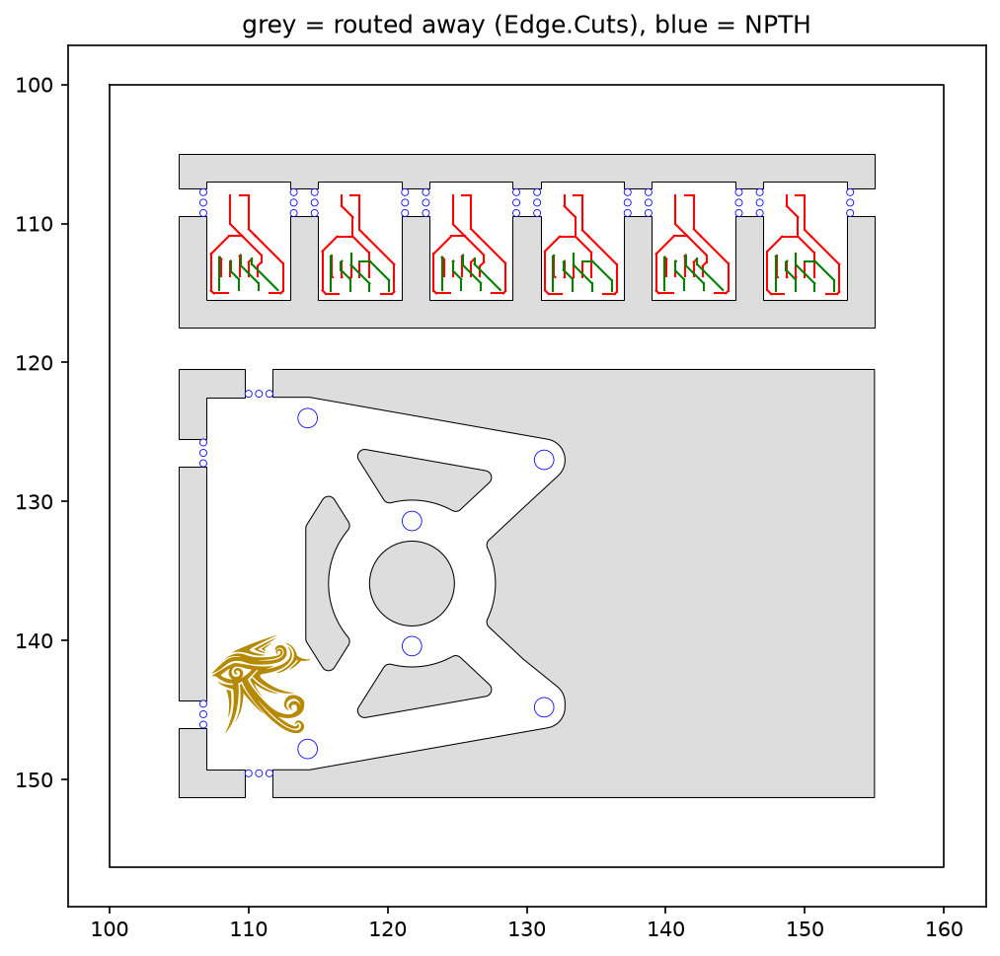

# 発注用パネル（エンコーダ基板 ×6 ＋ 上部固定基板 ×1）

エンコーダ基板（6 × 8.5 × 0.6mm）6 枚（IC5 側 ×3、IC7 側 ×3）と、上部固定基板（25.75 × 26.8 × 0.6mm、銅箔なし）1 枚を並べた発注用パネル。メイン基板とは別の注文で出す。



| 項目 | 値 |
|---|---|
| パネル寸法 | 60 × 56.3mm（枠 5mm、基板間・枠との隙間 2mm、上下の段の間に幅 3mm の桟） |
| ミシン目 | NPTH Φ0.5mm、ピッチ 0.75mm、1 か所 3 穴。穴は基板の外側（タブ側）に置き、折ったあとの残りは基板の外に出る |

## エンコーダ基板（上の段）

| 項目 | 値 |
|---|---|
| 基板の固定 | 左右の辺のタブ（上端から 0.5〜2.5mm、幅 2mm）＋ミシン目 |
| はんだ付けする辺（下辺） | タブなし。ルーターで切るのできれいな辺になる |
| 上辺 | タブなし（AS5047P のパッドまで 0.22mm しかないため） |

- ミシン目の穴から銅箔までは 0.8mm 以上
- パネル内の各コピーは別のネット名（`_2`, `_3` 付き）にしてあるので、DRC で「未接続」は出ない

## 上部固定基板（下の段）

| 項目 | 値 |
|---|---|
| 外形 | `../上部固定基板外形.dxf` から読み込み（円弧は 2µm 以下の誤差で折れ線にしている） |
| 基板の固定 | まっすぐな辺だけにタブ（幅 2mm）: 左辺 ×2、上下の短い直線辺 ×1 ずつ。曲線の辺にはタブを付けない |
| 内側の抜き | 3 か所の抜きと Φ6.1 の穴は Edge.Cuts、Φ1.4 の穴 ×6 は NPTH |
| ロゴ | `../ロゴ_ホワイトグリント.dxf` を F.SilkS に塗りつぶしで配置（左下の空き、幅 7.1mm）。外形・抜き・穴から 0.3mm 離して入る最大の大きさをスクリプトが自動で決める |

- DXF（y 上向き）を KiCad（y 下向き）に変換しているので、パネル上では DXF を上下反転した向きになる。銅箔のない板なので、裏返せば同じ形
- ロゴは 7.1mm と小さいため、線の 1 割ほどがシルクの最小線幅（0.15mm）より細い。細い先端や線の間の隙間は、印刷でつぶれたり欠けたりすることがある
- 左辺のタブの跡（ミシン目のバリ）が組み付けに当たる場合は、やすりで落とす

## 作り直し方

メイン基板（`../TORANEKO.Mk3.kicad_pcb`）のエンコーダ部分や `../上部固定基板外形.dxf` を修正したら、次で作り直す。

```bash
python3 make_panel.py
```

- 必要なライブラリ: `shapely`、`ezdxf`
- メイン基板上でエンコーダ基板を移動した場合も、`BOARDS` の外形の座標を直す（部品の相対位置が同じなら他は不要）
- エンコーダ基板の外形の位置（スクリプト内の `BOARDS`）が変わった場合は、そこも直す
- 上部固定基板の上下のタブ位置は、DXF の直線辺（x = -7.25〜0.13）の中央に決め打ちしている。外形を変えたらスクリプトの `utab_x0` を確認する

## 発注時の設定（JLCPCB の例）

- Panel by Customer（自分で面付け済み）、V-Cut なし
- 厚さ 0.6mm、2 層
- ガーバーは KiCad でこのファイルを開いて出力する
