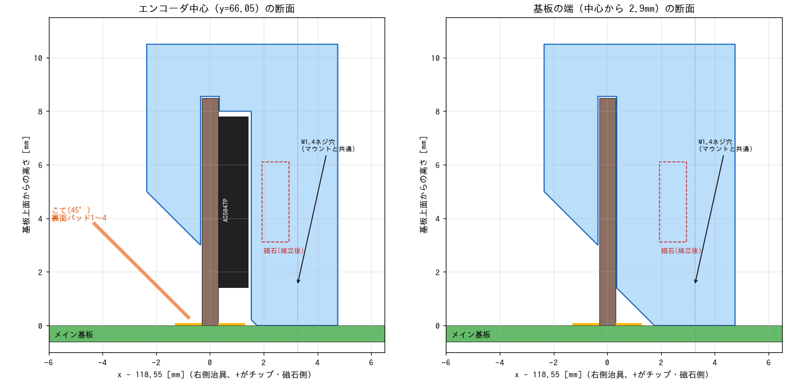

# エンコーダ基板はんだ付け治具

エンコーダ基板（6 × 8.5 × 0.6mm）をメイン基板に垂直に立ててはんだ付けするための 3D プリント治具。
モータマウントの代わりに、マウントと同じ M1.4 穴 2 個（左 x=98、右 x=121.8、y=62.3 / 79.8）に基板裏からネジ止めする。
磁石と同じ基準で位置が決まるので、AS5047P と磁石の位置関係がずれにくい。

| ファイル | 内容 |
|---|---|
| `encoder_solder_jig.py` | 生成スクリプト（CadQuery）。寸法はファイル先頭のパラメータで変える |
| `encoder_jig_L.stl/.step` | 左（U4、x=101.25）用 |
| `encoder_jig_R.stl/.step` | 右（U6、x=118.55）用。L と鏡像 |
| `slot_width_test.stl` | スロット幅テスト片（0.60〜0.85mm） |

## 保持の仕組み

- 上からスロット（既定 0.7mm 幅）で挟み、天井で上端を押さえる
- 裏面は高さ 3〜8.5mm の壁、チップ面は AS5047P の逃げの上端の帯と基板両端の帯で受ける
- 計算上、チップ・磁石方向 ±0.05mm、倒れ 1° 未満

## 使い方

1. `slot_width_test.stl` を刷り、エンコーダ基板が軽く入ってガタのない幅を選ぶ。`SLOT_C =（選んだ幅 − 0.6）/ 2` にして `python3 encoder_solder_jig.py` で作り直す
2. 前側の端面（エンコーダに近いネジ穴側）を下にした横置きで印刷（サポート不要）
3. 治具を M1.4 × 4 で基板裏からネジ止めし、エンコーダ基板をスロットに差し込む
4. 裏面パッド 1〜4 を、こて 45° 前後ではんだ付け
5. 治具を外し、チップ面の VCC/GND パッド（5, 6）をはんだ付け

モータマウント・モータ・上部固定基板を付ける前に使う（治具の高さ 10.5mm）。
